# Hackintosh com OpenCore
***Tentativa*** de criação de um **Guia de Instalação de um Hackintosh com OpenCore**
Este texto é uma adaptação/tradução do texto que está em https://dortania.github.io

## 1 - Verifique o seu Hardware

Tente localizar seu hardware nas listas abaixo. No caso, vou escolher a versão do MacOs baseado no meu chipset de vídeo (para ter menos trabalho). Por exemplo, a minha placa de Vídeo é a Intel HD 3000 (*Legacy Intel*), então vou usar o HighSierra.

- [Placas de Vídeo](https://dortania.github.io/GPU-Buyers-Guide/)
- [Placas de Rede Wi-fi](https://dortania.github.io/Wireless-Buyers-Guide/)

## 2 - Faça o Download do MacOs e prepare os arquivos

Acesse o site https://github.com/corpnewt/gibMacOS e faça o download do projeto. Descompacte, entre na pasta e execute o script **gibMacOS.command**

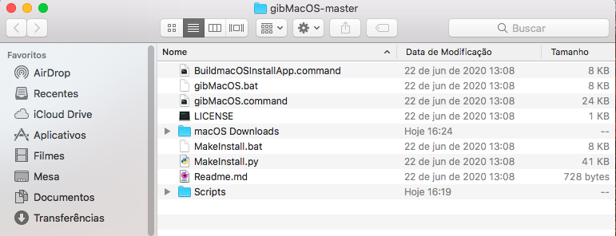
---
Vai aparecer um menu em que você deve digitar o número equivalente a versão do MacOS que quer baixar. Digite o número, aperte ENTER e aguarde o download.

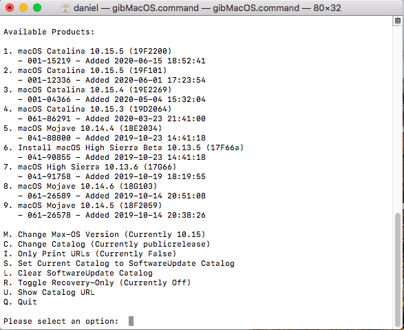
---
Quando o download for concluído pode fechar a janela do terminal. Os arquivos estarão na pasta "MacOs Downloads" e dentro dela a pasta referente a versão baixada.

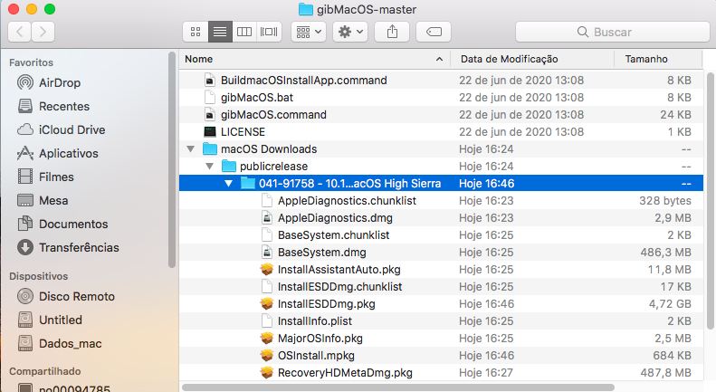
---
Agora vamos executar o script **BuildmacOSInstallApp.command** ,quando ele abrir, arraste para ele a pasta onde foi feito o download no passo anterior (ou então digite/cole o caminho completo da pasta).

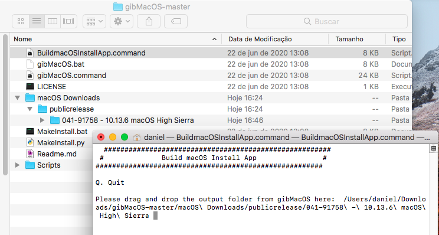
---
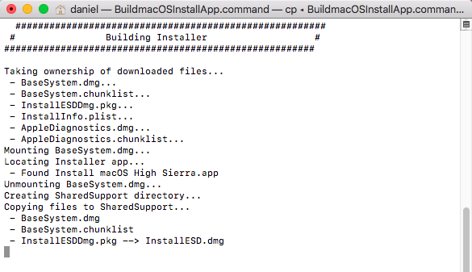
---
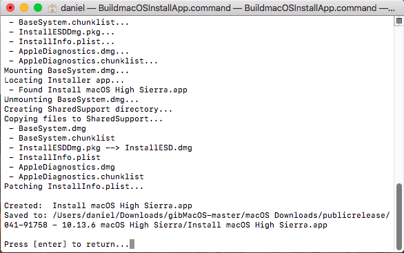
---
Quando concluir, pode sair deste script. Vai aparecer na pasta um novo arquivo chamado (no meu caso) *Instalação do macOS High Sierra*. Para facilitar a próxima etapa, mova esse novo arquivo para a pasta **Aplicativos**

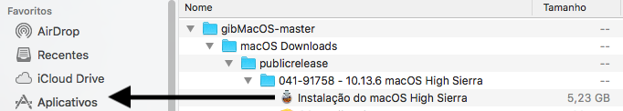
---

## 3 - Crie o pendrive de instalação

Agora, formataremos o pendrive para preparar o instalador do macOS e o OpenCore. Vamos usar o macOS Extended (HFS) com um mapa de partição GUID. Abra o **Utilitário de Disco (Disk Utility)** e selecine o pendrive no lado esquerdo. Clique em **Apagar (Erase)** e escolha conforme a imagem abaixo. Com isto ele criará 2 partições: a partição *MyVolume* como principal e a partição *EFI* (oculta), que será usada como uma partição de inicialização, na qual a sua placa-mãe procurará pelos arquivos de inicialização.

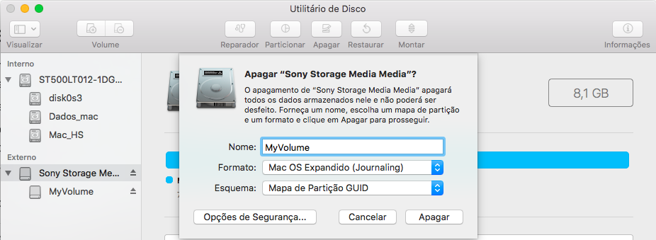
---

Com o pendrive formatado, vamos executar um comando para transerir a imagem criada no passo anterior. Esse comando está na página de suporte da [Apple](https://support.apple.com/en-us/HT201372), escolha o comando adequado a versão que está instalando.

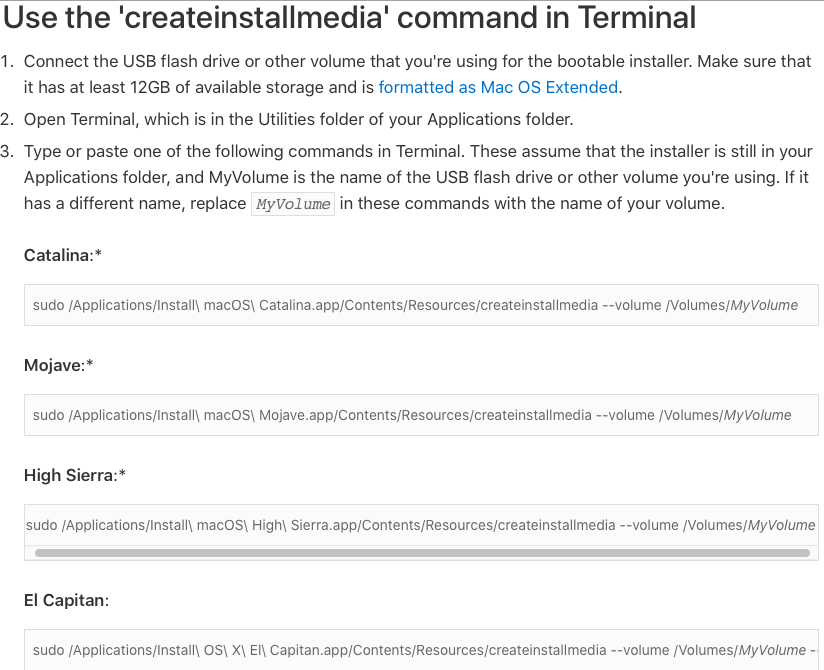
---

Cole o comando no terminal, digite sua senha, digite 'y' para confirmar. Ao final, o pendrive terá o nome do sistema escolhido. Quando concluir, pode fechar o terminal. Esse comando demora para ser concluído, tenha paciência.

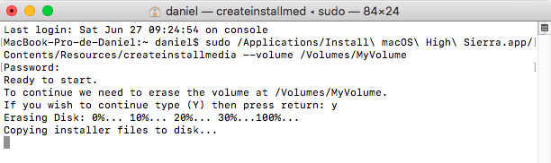
---

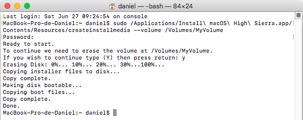
---

## 4 - Configurando o ambiente EFI do OpenCore

### 4.1 - Monte a partição EFI

Para configurar o EFI do pendrive, precisamos montar a partição. Para isso vamos usar o programa [MountEFI](https://github.com/corpnewt/MountEFI). Acesse o link, baixe (clone) o projeto, e execute o programa **MountEFI.command**.

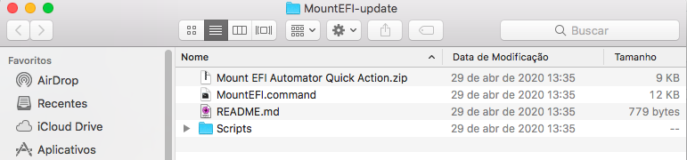
---

Ele listará os discos conectados, cabe a nós escolhermos o pendrive. No meu caso será a opção 2. 

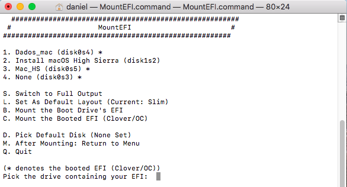
---

Ele vai carregar a partição EFI. Nesse momento ela deve estar vazia ainda.

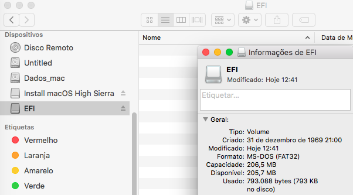
---

Pode fechar o terminal com o MountEFI.

### 4.1 - Configurando a partição EFI

Baixe o [OpenCorePkg](https://github.com/acidanthera/OpenCorePkg/releases/). Para configurar a estrutura de pastas do OpenCore, você deve pegar a pasta EFI encontrada nas versões do OpenCorePkg e copiá-la para a raiz da sua partição EFI. Nesse exemplo estou baixando a versão 0.5.9 (OpenCore-0.5.9-RELEASE.zip)

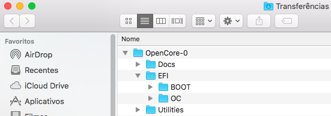
---

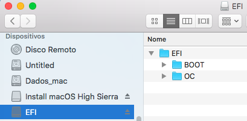
---

No caso, vemos que ele vem com vários arquivos na pasta Drivers and Tools, conforme print abaixo:

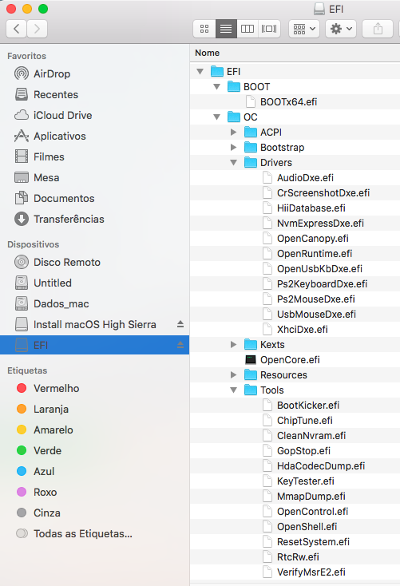
---

Precisamos remover os arquivos que não são necessários agora. Deixe as pastas Drivers e Tools conforme o print abaixo, não mexa nas outras pastas:

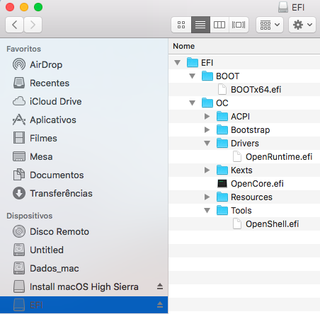
---

Agora podemos colocar os drivers de firmware necessários (.efi) na pasta Drivers, e os Kexts / ACPI em suas respectivas pastas. Observe que os drivers UEFI do Clover não são suportados pelo OpenCore (EmuVariableUEFI, AptioMemoryFix, OsxAptioFixDrv, etc). Consulte a [conversão do driver de firmware Clover](https://github.com/dortania/OpenCore-Desktop-Guide/blob/master/clover-conversion/clover-efi.md) para obter mais informações sobre os drivers suportados e aqueles mesclados no OpenCore.

Lembrando:

- SSDTs e DSDTs(.aml) vão para a pasta ACPI
- Kexts(.kext) vão para a pasta Kexts
- Firmware drivers(.efi) vão para a pasta Drivers

### 4.2 Baixando os kexts e EFIs necessários:

Vá para [Gathering Files](https://dortania.github.io/OpenCore-Desktop-Guide/ktext.html) para obter os kexts e drivers de firmware necessários.
