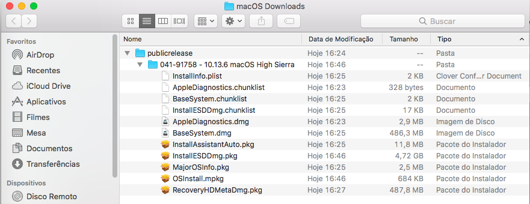

# Hackintosh com OpenCore
***Tentativa*** de criação de um **Guia de Instalação de um Hackintosh com OpenCore**
Este texto é uma adaptação/tradução do texto que está em https://dortania.github.io

## 1 - Verifique o seu Hardware

Tente localizar seu hardware nas listas abaixo e/ou entenda como é que funciona a coisa. No caso, vou escolher a versão do MacOs baseado no meu chipset de vídeo (para ter menos trabalho). Por exemplo, a minha placa de Vídeo é a Intel HD 3000 (*Legacy Intel*), então vou usar o HighSierra.

- [Compatibilidade de Hardware](https://github.com/dortania/OpenCore-Desktop-Guide/blob/master/extras/hardware.md)
- [Placas de Vídeo](https://dortania.github.io/GPU-Buyers-Guide/)
- [Placas de Rede Wi-fi](https://dortania.github.io/Wireless-Buyers-Guide/)

## 2 - Faça o Download do MacOs e prepare os arquivos

Acesse o site https://github.com/corpnewt/gibMacOS e faça o download do projeto. Descompacte, entre na pasta e execute o script **gibMacOS.command**

---
Vai aparecer um menu em que você deve digitar o número equivalente a versão do MacOS que quer baixar. Digite o número, aperte ENTER e aguarde o download.

---
Quando o download for concluído pode fechar a janela do terminal. Os arquivos estarão na pasta "MacOs Downloads" e dentro dela a pasta referente a versão baixada.

---
Agora vamos executar o script **BuildmacOSInstallApp.command** ,quando ele abrir, arraste para ele a pasta onde foi feito o download no passo anterior (ou então digite/cole o caminho completo da pasta).

---

---

---
Quando concluir, pode sair deste script. Vai aparecer na pasta um novo arquivo chamado (no meu caso) *Instalação do macOS High Sierra*. Para facilitar a próxima etapa, mova esse novo arquivo para a pasta **Aplicativos**

---

## 3 - Crie o pendrive de instalação

Agora, formataremos o pendrive para preparar o instalador do macOS e o OpenCore. Vamos usar o macOS Extended (HFS) com um mapa de partição GUID. Abra o **Utilitário de Disco (Disk Utility)** e selecine o pendrive no lado esquerdo. Clique em **Apagar (Erase)** e escolha conforme a imagem abaixo. Com isto ele criará 2 partições: a partição *MyVolume* como principal e a partição *EFI* (oculta), que será usada como uma partição de inicialização, na qual a sua placa-mãe procurará pelos arquivos de inicialização.

---

Com o pendrive formatado, vamos executar um comando para transerir a imagem criada no passo anterior. Esse comando está na página de suporte da [Apple](https://support.apple.com/en-us/HT201372), escolha o comando adequado a versão que está instalando.

---

Cole o comando no terminal, digite sua senha, digite 'y' para confirmar. Ao final, o pendrive terá o nome do sistema escolhido. Quando concluir, pode fechar o terminal. Esse comando demora para ser concluído, tenha paciência.

---

---

## 4 - Configurando o ambiente EFI do OpenCore

### 4.1 - Monte a partição EFI

Para configurar o EFI do pendrive, precisamos montar a partição. Para isso vamos usar o programa [MountEFI](https://github.com/corpnewt/MountEFI). Acesse o link, baixe (clone) o projeto, e execute o programa **MountEFI.command**.

---

Ele listará os discos conectados, cabe a nós escolhermos o pendrive. No meu caso será a opção 2. 

---

Ele vai carregar a partição EFI. Nesse momento ela deve estar vazia ainda.

---

Pode fechar o terminal com o MountEFI.

### 4.1 - Configurando a partição EFI

Baixe o [OpenCorePkg](https://github.com/acidanthera/OpenCorePkg/releases/). Para configurar a estrutura de pastas do OpenCore, você deve pegar a pasta EFI encontrada nas versões do OpenCorePkg e copiá-la para a raiz da sua partição EFI. Nesse exemplo estou baixando a versão 0.5.9 (OpenCore-0.5.9-RELEASE.zip)

---

---

No caso, vemos que ele vem com vários arquivos na pasta Drivers and Tools, conforme print abaixo:

---

Precisamos remover os arquivos que não são necessários agora. Deixe as pastas Drivers e Tools conforme o print abaixo, não mexa nas outras pastas:

---

Agora podemos colocar os drivers de firmware necessários (.efi) na pasta Drivers, e os Kexts / ACPI em suas respectivas pastas. Observe que os drivers UEFI do Clover não são suportados pelo OpenCore (EmuVariableUEFI, AptioMemoryFix, OsxAptioFixDrv, etc). Consulte a [conversão do driver de firmware Clover](https://github.com/dortania/OpenCore-Desktop-Guide/blob/master/clover-conversion/clover-efi.md) para obter mais informações sobre os drivers suportados e aqueles mesclados no OpenCore.

Lembrando:

- SSDTs e DSDTs(.aml) vão para a pasta ACPI
- Kexts(.kext) vão para a pasta Kexts
- Firmware drivers(.efi) vão para a pasta Drivers

### 4.2 Baixando os kexts e EFIs necessários:

Vá para [Gathering Files](https://dortania.github.io/OpenCore-Desktop-Guide/ktext.html) para obter os kexts e drivers de firmware necessários.

Consulte a seção de [hardware suportado](https://github.com/dortania/OpenCore-Desktop-Guide/blob/master/extras/hardware.md) para ter uma ideia melhor do que o macOS requer para inicializar, o suporte de hardware entre o Clover e o OpenCore é bastante semelhante.

#### 4.2.1 Firmware

Estes são os drivers usados pelo OpenCore, para a maioria dos sistemas, você só precisa de 2 drivers .efi para entrar em funcionamento:

- **HfsPlus.efi**

O [HfsPlus.efi](https://github.com/acidanthera/OcBinaryData/blob/master/Drivers/HfsPlus.efi) é necessário para ver volumes HFS (ou seja, partições/imagens do instalador do macOS ou partições Recovery). Não misture ele com outros drivers HFS.

- **OpenRuntime.efi**

Substituição do [AptioMemoryFix.efi](https://github.com/acidanthera/AptioFixPkg), usada como uma extensão do OpenCore para ajudar a corrigir o boot.efi das correções da NVRAM e melhorar o gerenciamento de memória.

***Para usuários de hardware mais antigo***

- **OpenUsbKbDxe.efi**

O [OpenUsbKbDxe.efi](https://github.com/acidanthera/OpenCorePkg/releases) é usado para o seletor OpenCore em sistemas legados executando o DuetPkg, não recomendado e até prejudicial para UEFI (Ivy Bridge e mais recente)

- **NvmExpressDxe.efi**

O [NvmExpressDxe.efi](https://github.com/acidanthera/OpenCorePkg/releases) é usado para Haswell e versões mais antigas quando nenhum driver NVMe está embutido no firmware, não é necessário se você não estiver usando uma unidade NVMe

- **XhciDxe.efi**

O [XhciDxe.efi](https://github.com/acidanthera/OpenCorePkg/releases) é sado para Sandy Bridge e versões mais antigas quando nenhum driver XHCI está embutido no firmware, não é necessário se você não estiver usando uma placa de expansão USB 3.0

- **HfsPlusLegacy.efi**

O [HfsPlusLegacy.efi](https://github.com/acidanthera/OcBinaryData/blob/master/Drivers/HfsPlusLegacy.efi) é uma variante herdada do HfsPlus, usada para sistemas que não possuem suporte à instrução RDRAND. Isso geralmente é visto na Sandy Bridge e em versões mais antigas. Para obter uma lista completa dos drivers compatíveis, consulte o item 11.2 na [Documentação em PDF do OpenCorePkg](https://github.com/acidanthera/OpenCorePkg/blob/master/Docs/Configuration.pdf).

**Esses arquivos devem ser gravados na pasta Drivers da sua partição EFI.**

#### 4.2.2 Kexts

Um kext é uma extensão do kernel. Você pode pensar no kext como um driver para o macOS. Esses arquivos devem ir para a pasta Kexts na sua EFI. Verifique quais deles voê realmente precisa, de acordo com o seu hardware. Por isso que é ***imperativo conhecer bem o seu hardware***.

***Nota do Windows e Linux:***

Kexts se parecerá com pastas normais no seu sistema operacional, verifique se a pasta que você está instalando tem uma extensão .kext visível (e não a adicione manualmente, se estiver faltando). Todos os kext listados abaixo podem ser encontrados pré-compilados no [Repositório Kext](https://onedrive.live.com/?authkey=%21APjCyRpzoAKp4xs&id=FE4038DA929BFB23%21455036&cid=FE4038DA929BFB23). Kexts aqui são compilados toda vez que há um novo commit.

**ESSES 2 KEXTS SÃO OBRIGATÓRIOS**

- VirtualSMC

O kext [VirtualSMC](https://github.com/acidanthera/VirtualSMC/releases) emula o chip SMC encontrado em macs reais, sem esse kext seu Hackintosh não inicializa. Uma alternativa ao VirtualSMC é o FakeSMC, que pode ter suporte melhor ou pior. Ele é comumente usado em hardware legado.

- Lilu

O kext [Lilu](https://github.com/vit9696/Lilu/releases) é um kext usado para corrigir muitos processos, necessário para AppleALC, WhateverGreen, VirtualSMC e muitos outros kexts. Sem o Lilu, eles não vão funcionar.

**VirtualSMC Plugins**

- SMCProcessor.kext

Usado para monitorar a temperatura da CPU, não funciona em sistemas baseados em CPU AMD

- SMCSuperIO.kext

Usado para monitorar a velocidade do cooler, não funciona em sistemas baseados em CPU AMD

- SMCLightSensor.kext

Usado para o sensor de luz ambiente em laptops, quem usa desktops não precisa utilizar. Se seu notebook não tem esse sensor, também não use.

- SMCBatteryManager.kext

Usado para medir as leituras de bateria em laptops, quem usa desktops não precisa utilizar. Se você usa seu notebook sem bateria, também não use.

**Placa de Vídeo**

- WhateverGreen

O kext [WhateverGreen](https://github.com/acidanthera/WhateverGreen/releases)Usado para correção de gráficos DRM, boardID, correções de buffer de quadros etc., todas as GPUs se beneficiam desse kext. Observe que o arquivo *SSDT-PNLF.dsl* incluído é necessário apenas para laptops e computadores All-In-One. Consulte [Introdução à ACPI](https://dortania.github.io/Getting-Started-With-ACPI/) para obter mais informações.

**Placa de Som**

- AppleALC

O kext [AppleALC](https://github.com/acidanthera/AppleALC/releases) é usado para patch AppleHDA, usado para fornecer áudio integrado. A AMD 15h/16h pode ter problemas com esse kext e os sistemas Ryzen/Threadripper raramente têm suporte para microfone.

**Placa de Rede Ethernet**

- IntelMausi

O kext [IntelMausi](https://github.com/acidanthera/IntelMausi/releases) é necessário para placas de rede Intel. Se sua placa usa os chipsets baseados no I211, você precisará do kext SmallTreeIntel82576.

- SmallTreeIntel82576

O kext [SmallTreeIntel82576](https://github.com/khronokernel/SmallTree-I211-AT-patch/releases) é necessário para as placas de rede Intel I211, baseadas no kext SmallTree (mas corrigidas para oferecer suporte à I211), necessário para a maioria das placas AMD que usam placas de rede Intel.

- AtherosE2200Ethernet

O kext [AtherosE2200Ethernet](https://github.com/Mieze/AtherosE2200Ethernet/releases) é necessário para as placas de rede Atheros e Killer

- RealtekRTL8111

O kext [RealtekRTL8111](https://github.com/Mieze/RTL8111_driver_for_OS_X/releases) é necessário para placas Gigabit Ethernet da Realtek

- LucyRTL8125Ethernet

O kext [LucyRTL8125Ethernet](https://github.com/Mieze/LucyRTL8125Ethernet) é necessário para placas Ethernet de 2,5 Gb da Realtek

**USB**

- USBInjectAll

O [USBInjectAll](https://github.com/Sniki/OS-X-USB-Inject-All/releases) é usado para injetar controladores USB Intel em sistemas sem portas USB definidas na ACPI. Não é necessário no Skylake e mais recente (exceção: as placas AsRock precisam dele). Não funciona em todas as CPUs AMD. 

- XHCI-unsupported

O [XHCI-unsupported](https://github.com/RehabMan/OS-X-USB-Inject-All) é necessário para controladores USB não nativos. Os sistemas baseados em CPU AMD não precisam dele. Chipsets comuns que precisam dele:

* H370
* B360
* H310
* Z390 (não é necessário no Mojave e mais recente)
* X79
* X99
* Placas AsRock (especificamente nas placas-mãe Intel, basicamente todas as placas)

**Wi-fi e Bluetooth**

- AirportBrcmFixup

O [AirportBrcmFixup](https://github.com/acidanthera/AirportBrcmFixup/releases) é usado para corrigir placas Broadcom que não sejam da Apple, ele não funcionará na Intel, Killer, Realtek, etc.

- BrcmPatchRAM

O [BrcmPatchRAM](https://github.com/acidanthera/BrcmPatchRAM/releases) é usado para fazer upload de firmware no chipset Broadcom Bluetooth, necessário para todas as placas que não sejam da Apple / Fenvi Airport. Deve ser usado em conjunto com o BrcmFirmwareData.kext.

  - BrcmPatchRAM3 para 10.14+ (em conjunto com BrcmBluetoothInjector)
  - BrcmPatchRAM2 para 10.11-10.14
  - BrcmPatchRAM para 10.10 ou mais antigo
  
A ordem no Kernel -> Adicionar deve ser:

1. BrcmBluetoothInjector
2. BrcmFirmwareData
3. BrcmPatchRAM3

AMD CPU Specific kexts:
